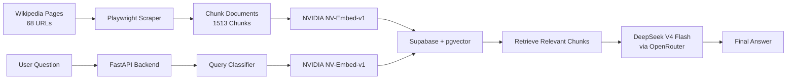

# 🏎️ Halos AI

Halos AI is an AI-powered Formula 1 chatbot that can answer both F1 trivia and statistics questions.

It uses:

- **RAG (Retrieval-Augmented Generation)** for Formula 1 knowledge and trivia
- **Text-to-SQL** for race statistics and historical data
- **DeepSeek V4** for natural language understanding and response generation

---

## 🚀 Features

- Answer Formula 1 trivia questions
- Retrieve race and driver statistics
- Automatic query classification
- Wikipedia-based knowledge retrieval
- Natural language to SQL conversion
- Modern chat interface
- Weekly automatic data updates
- Backend status monitoring

---

## 🏗️ Architecture

---

## 🛠️ Tech Stack

### Frontend
- React
- TypeScript
- Vite
- Tailwind CSS

### Backend
- Python
- FastAPI
- Uvicorn

### AI & Data
- DeepSeek V4 Flash(OpenRouter)
- NVIDIA NV-Embed-v1
- PostgreSQL (Supabase)
- pgvector

### Data Collection
- FastF1
- Playwright

### Deployment
- Vercel
- Render
- GitHub Actions

---

## 📊 Data Coverage

### Knowledge Base
- 68 Wikipedia pages
- 1,513 vector chunks

### Statistics Database
- Seasons: 2021–2026
- 136 races
- 2,410 race results
- 2,389 qualifying results

---

## 🌐 Deployment

### Frontend
https://halos-ai.vercel.app

### Backend
https://halos-ai.onrender.com

---

## 💬 Example Questions

### Statistics
- Who won the 2025 Monaco Grand Prix?
- How many wins does Max Verstappen have since 2021?
- Which constructor scored the most points in 2024?

### Trivia
- Tell me about Ayrton Senna.
- Why is Monaco considered a special race?
- Explain Ferrari's history in Formula 1.

---

## 👨‍💻 Author

**Vinesh**

Built with ❤️ 
